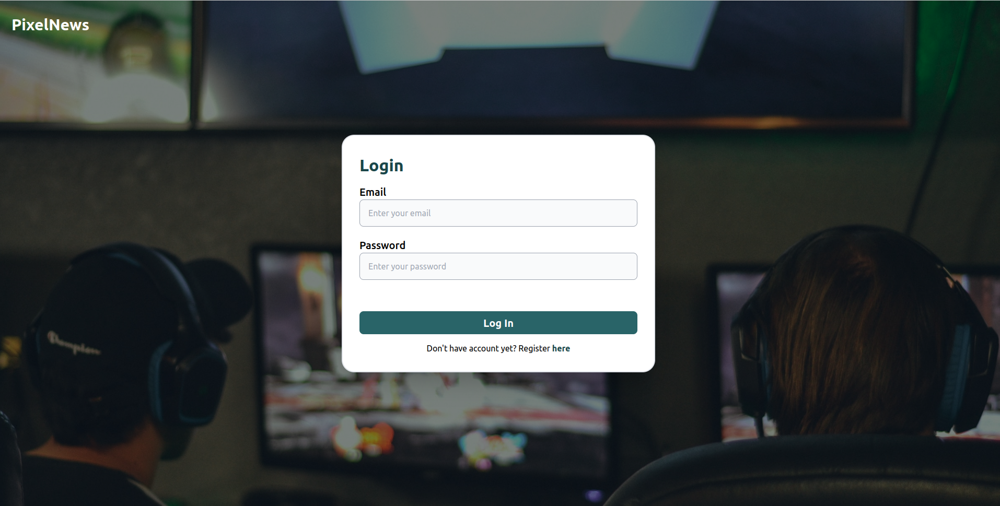
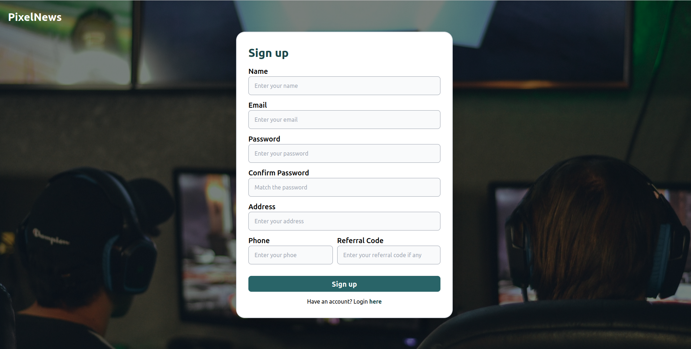
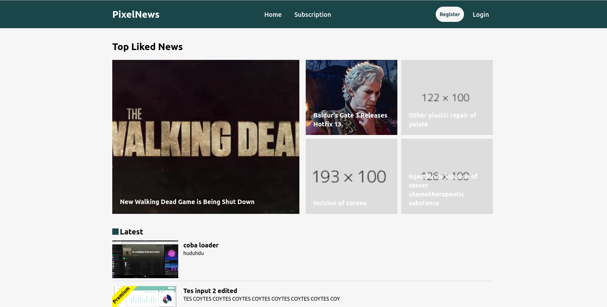
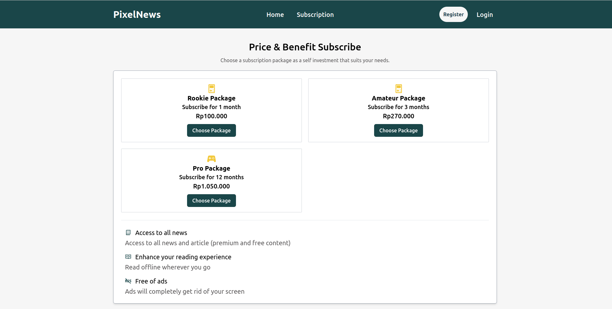
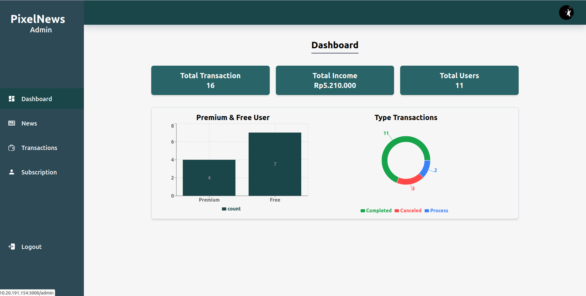
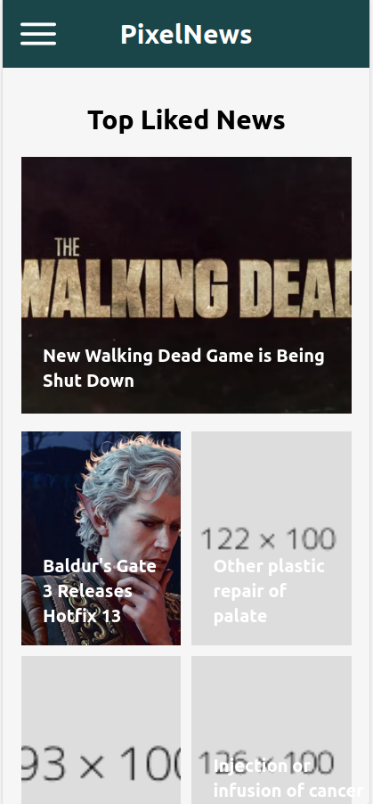

# Assignment React

This is Next Assignment is a News Website. This website contain user page and admin page. User Page can read news, buy subscription, login, etc. Admin Page can do CRUD News, Edit transactions, deactive user, and showing dashboard.

## How to setup?

1.  Setup Next JS
    ```
    npx create-next-app@latest assignment-next
    ```
2.  Install package
    ```
    npm i @types/uuid axios js-cookie recharts swr tailwind-animated zustand
    ```
3.  Configure Tailwind in file "tailwind.config.js"

    ```ts
    import type { Config } from "tailwindcss";

    const config: Config = {
      content: [
        "./src/pages/**/*.{js,ts,jsx,tsx,mdx}",
        "./src/components/**/*.{js,ts,jsx,tsx,mdx}",
        "./src/app/**/*.{js,ts,jsx,tsx,mdx}",
      ],
      theme: {
        extend: {
          backgroundImage: {
            "gradient-radial": "radial-gradient(var(--tw-gradient-stops))",
            "gradient-conic": "conic-gradient(from 180deg at 50% 50%, var(--tw-gradient-stops))",
          },
          colors: {
            primary: "#1A4649",
            secondary: "#2D4955",
            primaryBg: "#F6F6F6",
            primaryBtn: "#296468",
            secondaryText: "#5B595A",
            dangerText: "#FF4949",
          },
        },
      },
      plugins: [require("tailwindcss-animated")],
    };
    export default config;
    ```

## How to Start?

1. To run Next application

   ```
   npm run dev
   ```

2. Run Json Web server

   ```
   json-server --watch db.json
   ```

## Screenshot

1. Login Page
   

2. Register Page
   

3. Home Page
   

4. Subscription Page
   

5. Admin Home Page
   

6. Mobile Home Page
   

## API

1. Path : /transactions

   Method:

   - GET /transactions
   - POST /transactions/:id
   - PATCH /transactions/:id
   - DELETE /transactions/:id

   Response:

   ```json
   [
     {
       "id": "string",
       "user_id": "string",
       "type": "string",
       "transaction_date": "Date",
       "total_paid": "number",
       "status": "string"
     }
   ]
   ```

2. Path : /users

   Method:

   - GET /users
   - POST /users/:id
   - PATCH /users/:id
   - DELETE /users/:id

   Response:

   ```json
   [
     {
       "id": "string",
       "name": "string",
       "email": "string",
       "password": "string",
       "phone": "string",
       "address": "string",
       "like": ["string", "string"],
       "plan": "string",
       "imgUrl": "string",
       "expired_subs": "Date",
       "role": "string",
       "referral_code": "string"
     }
   ]
   ```

3. Path :

   Method:

   - GET /news
   - POST /news/:id
   - PATCH /news/:id
   - DELETE /news/:id

   Response:

   ```json
   [
     {
       "id": "string",
       "title": "string",
       "description": "string",
       "isPremium": "boolean",
       "like": "number",
       "share": "number",
       "img": "string",
       "category": "string",
       "created_at": "Date",
       "updated_at": "Date"
     }
   ]
   ```
